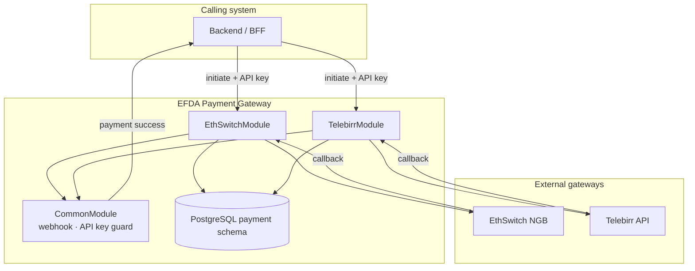

# EFDA Payment Gateway — architecture & planning

How this **NestJS microservice** was designed, what it owns, and how payment providers plug in.

| Document | Contents |
|----------|----------|
| **This file** | Service boundaries, structure, shared platform, extension plan |
| [`ethswitch.md`](ethswitch.md) | EthSwitch (NGB) hosted payment page integration |
| [`telebirr.md`](telebirr.md) | Telebirr H5 C2B hosted checkout integration |

---

## 1. Purpose & boundaries

### What we built

**EFDA Payment Gateway** is a dedicated payment-gateway microservice. It sits between a **calling system** (licensing backend, BFF, or internal client) and **external payment providers** (EthSwitch NGB, Telebirr).

It owns:

- Provider protocol (auth, order creation, callbacks, signing)
- Payment attempt persistence and audit logs
- Idempotent status transitions
- Notifying the caller when a payment succeeds

It does **not** own:

- Application workflow (status codes, screening, licensing rules)
- Fee calculation or `PaymentInfo` creation
- Applicant authentication (delegated to the caller via API key on initiate)

### Design goals

| Goal | How we achieved it |
|------|-------------------|
| **Isolation** | Gateway credentials and traffic are scoped to this deployable |
| **Provider modularity** | One NestJS feature module per provider (`ethswitch`, `telebirr`) |
| **Thin integration contract** | Callers pass `{ paymentInfoId, amount, currency? }` on initiate |
| **Auditability** | Every inbound/outbound gateway call is logged per provider |
| **Safe retries** | Unique `merch_order_id`, idempotent callbacks, resume live checkout URLs |
| **Observable dev experience** | Swagger in non-production, structured logs |

---

## 2. High-level architecture



### Request lifecycle (all providers)

1. Caller creates a pending payment upstream and calls **initiate** with amount context.
2. Microservice returns a **checkout URL** (or resumes an existing live attempt).
3. Payer completes payment on the provider’s hosted UI.
4. Provider notifies this service (callback, redirect, or reconcile).
5. On success, **PaymentWebhookService** POSTs to `PAYMENT_SUCCESS_WEBHOOK_URL`.
6. Caller updates its own records (payment completed, application advanced).

---

## 3. Repository layout

```
efda-payment-gateway/
  database/
    001_init.sql          # EthSwitch tables
    002_telebirr.sql      # Telebirr tables
  docs/
    architecture.md       # this file
    ethswitch.md
    telebirr.md
  src/
    main.ts               # bootstrap, raw body, Swagger
    app.module.ts         # root wiring
    swagger.ts
    config/
      payment.config.ts   # shared: API key, webhook URL
      ethswitch.config.ts
      telebirr.config.ts
    common/
      common.module.ts    # global: webhook + guard
      payment-webhook.service.ts
      guards/service-api-key.guard.ts
      dto/payment.dto.ts  # InitiatePaymentDto, ApiResponseDto
      utils/snake-case.ts
    ethswitch/            # → see docs/ethswitch.md
    telebirr/             # → see docs/telebirr.md
```

### Module pattern (planned extension point)

Every online payment provider follows the same layers:

| Layer | File | Responsibility |
|-------|------|----------------|
| Module | `{provider}.module.ts` | TypeORM entities, HTTP client, providers |
| Controller | `{provider}.controller.ts` | Routes, Swagger, guards, throttling |
| Service | `{provider}.service.ts` | Orchestration, idempotency, status machine |
| Api client | `{provider}-api.client.ts` | Outbound HTTP + provider auth |
| Token cache | `token-cache.service.ts` | In-memory token with TTL (if needed) |
| Entities | `entities/*` | `{provider}_transaction`, `{provider}_api_log` |
| Config | `config/{provider}.config.ts` | `{PROVIDER}_*` env namespace |
| Migration | `database/00N_{provider}.sql` | Provider-specific DDL |

Adding a third provider = new folder + config + migration + `AppModule` import. Shared webhook and initiate DTO stay unchanged.

---

## 4. NestJS platform

### Bootstrap (`main.ts`)

- Custom JSON parser preserving **raw body** (callback deserialization)
- Global `ValidationPipe` (whitelist + transform)
- Swagger at `/api/docs` when `NODE_ENV !== production`
- Default port `3100`

### Root module (`app.module.ts`)

| Import | Role |
|--------|------|
| `ConfigModule` | Loads `payment`, `ethswitch`, `telebirr` config namespaces |
| `ScheduleModule` | Telebirr reconciliation cron |
| `CommonModule` | Global webhook + API key guard |
| `ThrottlerModule` | 10 requests/min on sensitive endpoints |
| `TypeOrmModule` | PostgreSQL, `payment` schema entities |
| `EthSwitchModule` | EthSwitch feature |
| `TelebirrModule` | Telebirr feature |

### Shared initiate contract

All providers use the same body on `POST /api/{provider}/initiate/:applicationId`:

```json
{
  "paymentInfoId": 123,
  "amount": 1.00,
  "currency": "ETB"
}
```

Success responses wrap provider-specific data in the standard envelope:

```json
{
  "success": true,
  "message": "Payment initiated successfully.",
  "data": {
    "checkoutUrl": "…",
    "merchOrderId": "…",
    "transactionId": 1,
    "applicationId": 12345,
    "amount": "1.00",
    "isResume": false
  }
}
```

### Payment-success webhook

`PaymentWebhookService` POSTs to `PAYMENT_SUCCESS_WEBHOOK_URL`:

```json
{
  "paymentInfoId": 123,
  "applicationId": 456,
  "merchOrderId": "FL456…",
  "provider": "ETHSWITCH",
  "transId": "…"
}
```

`provider` is `ETHSWITCH` or `TELEBIRR` so the caller can route internally.

---

## 5. Security model

| Concern | Approach |
|---------|----------|
| **Initiate endpoints** | Optional `SERVICE_API_KEY` via `x-api-key` or `Authorization: Bearer` |
| **EthSwitch callback** | No signature; order id + amount/currency match |
| **Telebirr callback** | RSA signature verification (PSS / PKCS#1 variants on redirect) |
| **Public URLs** | `*_NOTIFY_URL`, `*_CANCEL_URL` must be reachable by providers (use ngrok in local dev) |
| **Secrets** | `.env` locally; vault/CI in production — never commit PEMs or passwords |
| **Swagger** | Disabled when `NODE_ENV=production` |

When `SERVICE_API_KEY` is empty, initiate is unauthenticated (local development only).

---

## 6. Data architecture

Single PostgreSQL database, schema **`payment`**, **one transaction table + one api_log table per provider**.

| Table | Provider | Purpose |
|-------|----------|---------|
| `ethswitch_transaction` | EthSwitch | One row per HPP attempt |
| `ethswitch_api_log` | EthSwitch | Inbound/outbound audit |
| `telebirr_transaction` | Telebirr | One row per checkout attempt |
| `telebirr_api_log` | Telebirr | Inbound/outbound audit (+ `signature_valid`) |

Common columns across transaction tables:

- `payment_info_id` — opaque id from caller
- `application_id` — for redirects and webhook
- `merch_order_id` — unique idempotency key with gateway
- `trade_status` — internal status machine
- `checkout_url` — URL returned to payer

`payment_info_id` is **not** a foreign key to the caller’s database — this service stays decoupled.

Migrations are plain SQL files run manually (`database/001_init.sql`, `002_telebirr.sql`). TypeORM `synchronize` is **off**.

---

## 7. Cross-cutting concerns

| Concern | Implementation |
|---------|----------------|
| Rate limiting | `@nestjs/throttler` — 10 req/min on initiate, reconcile, redirect-callback |
| Token caching | In-memory per provider; 90% TTL; invalidate on HTTP 401 |
| Logging | NestJS `Logger` on services and controllers |
| Error responses | `ApiResponseDto.success` / `.error` envelope |
| Resume logic | Reuse live `checkout_url` within timeout window before creating new order |
| Reconciliation | Telebirr only — cron job + on-demand endpoint (see [`telebirr.md`](telebirr.md)) |

---

## 8. Configuration overview

Shared (`.env`):

| Variable | Purpose |
|----------|---------|
| `PORT` | Listen port (default `3100`) |
| `NODE_ENV` | `production` disables Swagger |
| `DATABASE_*` | PostgreSQL connection |
| `SERVICE_API_KEY` | Initiate / reconcile auth |
| `PAYMENT_SUCCESS_WEBHOOK_URL` | Caller webhook on success |

Provider-specific variables are documented in:

- [`ethswitch.md` § Configuration](ethswitch.md#configuration)
- [`telebirr.md` § Configuration](telebirr.md#configuration)

Full template: `.env.example`

---

## 9. Operations

| Topic | Guidance |
|-------|----------|
| **Local dev** | Providers cannot POST to `localhost` — tunnel `*_NOTIFY_URL` with ngrok |
| **Idempotency** | Safe to retry initiate; duplicate callbacks are ignored when terminal |
| **Disputes** | Use `*_api_log` + transaction `raw_callback` / status fields |
| **Production** | `NODE_ENV=production`, strong `SERVICE_API_KEY`, secrets outside git |
| **Swagger** | `http://localhost:3100/api/docs` — authorize with `SERVICE_API_KEY` |
| **Health** | Process listens on `PORT`; DB connectivity required for initiate |

---

## 10. Roadmap & extension plan

### Implemented

- [x] EthSwitch (NGB) hosted payment page — [`ethswitch.md`](ethswitch.md)
- [x] Telebirr H5 C2B hosted checkout — [`telebirr.md`](telebirr.md)
- [x] Shared webhook with `provider` discriminator
- [x] Per-provider audit logs

### Planned (optional)

- [ ] Health check endpoint (`/health`, DB ping)
- [ ] Metrics (Prometheus) on initiate/callback latency
- [ ] Dead-letter or alert when webhook delivery fails
- [ ] Additional providers (same module pattern as §3)
- [ ] Rename deployable artifact consistently (`efda-payment-gateway` vs folder name)

### Adding a new provider — checklist

1. Create `src/{provider}/` using the module pattern in §3
2. Add `config/{provider}.config.ts` and `.env.example` entries
3. Add `database/00N_{provider}.sql`
4. Register entities in `app.module.ts` TypeORM config
5. Import `{Provider}Module` in `AppModule`
6. Write `docs/{provider}.md`
7. Point caller’s pay route at `POST /api/{provider}/initiate/:applicationId`
8. Register public callback URLs with the provider

---

## 11. Related documents

- [`ethswitch.md`](ethswitch.md) — NGB API, HPP flow, callbacks, env vars
- [`telebirr.md`](telebirr.md) — fabric token, signing, reconcile, env vars
- [`../README.md`](../README.md) — quick start
- [NBG API sandbox](https://ethswitch.github.io/ngb-api-sandbox/) — EthSwitch reference
