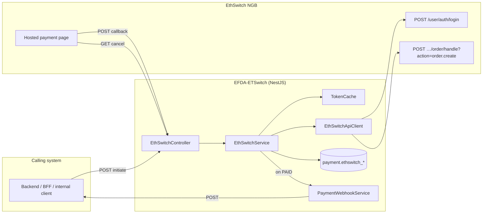
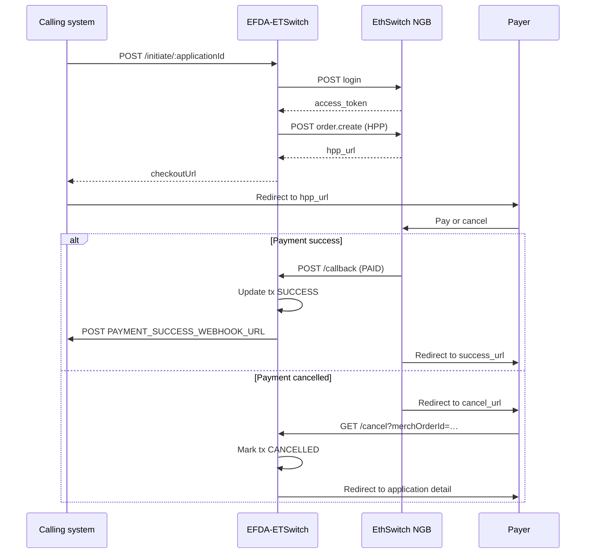
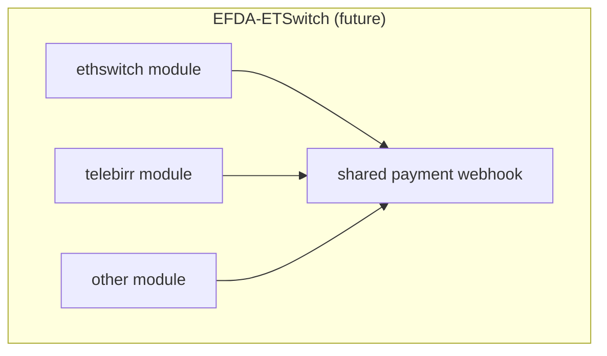

# EFDA-ETSwitch — architecture

How this **NestJS** microservice is structured and how the **EthSwitch (NGB)** hosted payment page integration works.

> **Scope today:** EthSwitch only. Additional providers (e.g. Telebirr) can be added as sibling NestJS modules using the same layout described in [§7](#7-adding-more-payment-providers).

---

## 1. What this service does

**EFDA-ETSwitch** is a payment-gateway adapter for EthSwitch (NGB). It:

- Authenticates with the NGB API and registers hosted payment orders
- Exposes HTTP endpoints for **initiate**, **callback**, and **cancel**
- Persists payment attempts and full gateway audit logs in PostgreSQL
- Notifies a configured **payment-success webhook** when a payment completes

It does **not** own business workflows upstream (application status, fee rules, etc.). Callers pass payment context on initiate; this service handles gateway protocol only.



---

## 2. NestJS application structure

### 2.1 Bootstrap (`main.ts`)

- Creates the NestJS app with a custom JSON body parser that preserves **raw body** on requests (needed for callback deserialization)
- Registers global `ValidationPipe` (whitelist + transform)
- Mounts **Swagger** at `/api/docs` when `NODE_ENV !== production`
- Listens on `PORT` (default `3100`)

### 2.2 Root module (`app.module.ts`)

| Import | Role |
|--------|------|
| `ConfigModule` | Loads `.env` and `ethswitch.config.ts` globally |
| `ThrottlerModule` | Rate limiting (10 req/min on initiate) |
| `TypeOrmModule` | PostgreSQL connection to `payment` schema entities |
| `EthSwitchModule` | EthSwitch feature module |

### 2.3 EthSwitch module layers

```
src/
  main.ts
  app.module.ts
  swagger.ts
  config/
    ethswitch.config.ts       # ETHSWITCH_* env → typed config
  ethswitch/
    ethswitch.module.ts
    ethswitch.controller.ts   # HTTP: /api/ethswitch/*
    ethswitch.service.ts      # Orchestration logic
    ethswitch-api.client.ts   # Outbound HTTP to NGB
    token-cache.service.ts    # In-memory bearer token cache
    payment-webhook.service.ts
    guards/service-api-key.guard.ts
    dto/ethswitch.dto.ts
    entities/
      ethswitch-transaction.entity.ts
      ethswitch-api-log.entity.ts
    constants/statuses.ts
    utils/
      snake-case.ts           # Request bodies → snake_case for NGB
      normalize-gateway-response.ts  # Responses hpp_url → hppUrl
database/
  001_init.sql
```

**Request flow:**

1. **Controller** — routing, Swagger decorators, guards, throttling
2. **Service** — resume logic, status transitions, idempotent callbacks
3. **ApiClient** — login + `order.create`, headers, error handling
4. **Entities / repositories** — TypeORM persistence
5. **Webhook service** — fire-and-forget POST on success

### 2.4 Security

| Layer | Mechanism |
|-------|-----------|
| Initiate | Optional `SERVICE_API_KEY` via `x-api-key` or `Authorization: Bearer` (`ServiceApiKeyGuard`) |
| Callback / cancel | Public (gateway/browser); trust via order id + amount match on callback |
| Outbound | NGB bearer token from username/password login |

When `SERVICE_API_KEY` is empty, initiate is open (dev only).

---

## 3. HTTP API

| Method | Path | Auth | Description |
|--------|------|------|-------------|
| `POST` | `/api/ethswitch/initiate/:applicationId` | API key (if set) | Start or resume HPP payment |
| `POST` | `/api/ethswitch/callback` | None | NGB completion webhook |
| `GET` | `/api/ethswitch/cancel` | None | Payer cancel redirect → SPA |

Swagger (dev): `http://localhost:3100/api/docs`

### Initiate request body

```json
{
  "paymentInfoId": 123,
  "amount": 500.00,
  "currency": "ETB"
}
```

### Initiate success response

```json
{
  "success": true,
  "message": "Payment initiated successfully.",
  "data": {
    "success": true,
    "checkoutUrl": "https://cbs-uat.ethswitch.et:4443/hpp/…",
    "merchOrderId": "FL12345a1b2c3d4e5f6",
    "transactionId": 1,
    "applicationId": 12345,
    "amount": "500.00",
    "isResume": false
  }
}
```

---

## 4. How EthSwitch (NGB) works

Official reference: [NBG API sandbox](https://ethswitch.github.io/ngb-api-sandbox/).

EthSwitch uses the **Hosted Payment Page (HPP)** model: this service registers an order, returns a `checkoutUrl`, and the payer completes payment on EthSwitch’s hosted UI.

### 4.1 End-to-end sequence



### 4.2 Gateway authentication

`EthSwitchApiClient.authenticate()`:

```
POST {ETHSWITCH_BASE_URL}/user/auth/login
Content-Type: application/json

{ "username": "…", "password": "…" }
```

Response (snake_case):

```json
{ "access_token": "…", "expires_in": 300 }
```

`TokenCacheService` stores the token at **90% of `expires_in`** and evicts it on HTTP **401** from order calls.

### 4.3 Register HPP order (`order.create`)

```
POST {ETHSWITCH_BASE_URL}/nbg/api/v1/payment/order/handle?action=order.create
Authorization: Bearer {access_token}
X-Correlation-ID: {uuid}
X-Biller-BIN: {ETHSWITCH_BILLER_BIN}
Content-Type: application/json
```

Body (serialized as snake_case):

```json
{
  "amount": 500,
  "currency": "ETB",
  "merchant_order_number": "FL12345a1b2c3d4e5f6",
  "idempotency_key": "FL12345a1b2c3d4e5f6",
  "description": "Application 12345 Facility License Fee",
  "success_url": "{ETHSWITCH_FRONTEND_BASE_URL}/applications/detail/12345",
  "cancel_url": "{ETHSWITCH_CANCEL_URL}?merchOrderId=…",
  "callback_url": "{ETHSWITCH_NOTIFY_URL}",
  "line_items": [
    {
      "item_name": "Application Fee",
      "quantity": 1,
      "unit_price": 500,
      "total_usage_amount": 500
    }
  ]
}
```

Response fields (gateway uses snake_case; normalized internally):

| Gateway field | Internal use |
|---------------|--------------|
| `hpp_url` | `checkoutUrl` returned to caller |
| `hpp_token` | Stored on transaction |
| `order_reference` | Stored on transaction |
| `expires_at` | HPP link expiry for resume logic |

### 4.4 Initiate service logic

`EthSwitchService.initiatePayment()`:

1. Validate `amount > 0`
2. **Resume** — if a `PENDING` row exists with a live `checkout_url` (within `expires_at` or `ETHSWITCH_TIMEOUT_EXPRESS`), return it with `isResume: true`
3. **Timeout stale** — mark older `PENDING` rows as `TIMEOUT`
4. **New order** — `merchOrderId` = `FL{applicationId}{12-char random}`
5. Call gateway `order.create`, persist transaction, return `checkoutUrl`
6. Log outbound call to `ethswitch_api_log`

### 4.5 Callback (`POST /api/ethswitch/callback`)

NGB posts a JSON payload on completion. Important fields:

| Field | Meaning |
|-------|---------|
| `status` / `current_status` | `PAID` or `FAILED` |
| `data.request_id` | Our `merch_order_id` |
| `transaction_id` | Gateway transaction id |
| `data.bill_info` | Amount/currency for integrity check |

Rules:

- Always respond `{ "code": "SUCCESS" }` so the gateway does not retry indefinitely
- Match transaction by `merch_order_id`
- **Idempotent** — ignore if already `SUCCESS` or `FAIL`
- On `PAID`: verify amount/currency; mismatch → `FAIL`
- On success: persist `raw_callback`, POST `PAYMENT_SUCCESS_WEBHOOK_URL`

NGB callbacks have **no signature**; validation is **order id + amount/currency match**.

### 4.6 Cancel (`GET /api/ethswitch/cancel`)

Browser hit when the payer abandons HPP. If the transaction is still `PENDING`, mark `CANCELLED`, then HTTP redirect to:

```
{ETHSWITCH_FRONTEND_BASE_URL}/applications/detail/{applicationId}
```

The payer can initiate again later.

### 4.7 Payment-success webhook

On `PAID`, `PaymentWebhookService` POSTs to `PAYMENT_SUCCESS_WEBHOOK_URL`:

```json
{
  "paymentInfoId": 123,
  "applicationId": 456,
  "merchOrderId": "FL456…",
  "transId": "PAY…"
}
```

If the URL is unset, the event is logged and skipped.

### 4.8 Transaction status lifecycle

```
PENDING ──► SUCCESS   (callback: PAID)
PENDING ──► FAIL      (callback: FAILED, or amount mismatch)
PENDING ──► TIMEOUT   (stale; new initiate creates fresh order)
PENDING ──► CANCELLED (payer cancel redirect)
```

Terminal states (`SUCCESS`, `FAIL`) are idempotent for duplicate callbacks.

---

## 5. Data model

PostgreSQL schema `payment` — see `database/001_init.sql`.

### `payment.ethswitch_transaction`

One row per payment **attempt**.

| Column | Purpose |
|--------|---------|
| `payment_info_id` | Caller-supplied payment record id |
| `application_id` | Caller application id (redirects + webhook) |
| `merch_order_id` | Unique idempotency key sent to NGB |
| `trade_status` | `PENDING`, `SUCCESS`, `FAIL`, `TIMEOUT`, `CANCELLED` |
| `checkout_url` | HPP URL for the payer |
| `expires_at` | Gateway-reported link expiry |
| `raw_callback` | Full callback JSON (audit / disputes) |

### `payment.ethswitch_api_log`

Every inbound and outbound gateway interaction: direction, method, payloads, HTTP status, duration.

---

## 6. Configuration

All settings come from `.env` (see `.env.example`).

### Service

| Variable | Purpose |
|----------|---------|
| `PORT` | Listen port (default `3100`) |
| `NODE_ENV` | `production` disables Swagger |
| `DATABASE_*` | PostgreSQL connection |
| `SERVICE_API_KEY` | Optional initiate auth |
| `PAYMENT_SUCCESS_WEBHOOK_URL` | POST target on successful payment |

### EthSwitch / NGB

| Variable | Purpose |
|----------|---------|
| `ETHSWITCH_BASE_URL` | Gateway host, e.g. `https://cbs-uat.ethswitch.et:4443` |
| `ETHSWITCH_USERNAME` | Login username |
| `ETHSWITCH_PASSWORD` | Login password |
| `ETHSWITCH_BILLER_BIN` | `X-Biller-BIN` header (sandbox: `NEEUETAA`) |
| `ETHSWITCH_CURRENCY` | Default currency (`ETB`) |
| `ETHSWITCH_FRONTEND_BASE_URL` | SPA origin for success redirect |
| `ETHSWITCH_CANCEL_URL` | This service’s cancel endpoint (public URL) |
| `ETHSWITCH_NOTIFY_URL` | This service’s callback endpoint (public URL) |
| `ETHSWITCH_TIMEOUT_EXPRESS` | Pending link window, e.g. `120m` |

**Sandbox credentials** (from [NBG API docs](https://ethswitch.github.io/ngb-api-sandbox/)):

| Variable | Example |
|----------|---------|
| `ETHSWITCH_USERNAME` | `admin@eeu.et` |
| `ETHSWITCH_PASSWORD` | `password` |
| `ETHSWITCH_BILLER_BIN` | `NEEUETAA` |

---

## 7. Adding more payment providers

Add a sibling NestJS module per provider, mirroring `src/ethswitch/`:

| Layer | Responsibility |
|-------|----------------|
| `{provider}.module.ts` | Wires controller, service, client, entities |
| `{provider}.controller.ts` | `initiate`, `callback`, `cancel` (+ `reconcile` if needed) |
| `{provider}.service.ts` | Idempotency, resume, status machine |
| `{provider}-api.client.ts` | Provider HTTP + auth |
| `entities/` | `{provider}_transaction`, `{provider}_api_log` |
| `config/{provider}.config.ts` | `{PROVIDER}_*` env namespace |

Shared pattern for all online gateways:

1. Caller POSTs initiate with `{ paymentInfoId, amount, currency? }`
2. Service returns `checkoutUrl` (or equivalent)
3. Gateway callbacks hit this service
4. On success → same `PaymentWebhookService` (extend payload with `provider` if needed)

### Telebirr (planned)

Typical differences from EthSwitch when implementing a `telebirr` module:

| Aspect | EthSwitch (implemented) | Telebirr (typical) |
|--------|-------------------------|---------------------|
| Auth | Username/password → bearer | Fabric app token |
| Initiate | `order.create` → `hpp_url` | Signed create-order request |
| Callback | JSON, no signature | Signed `notify_url` payload |
| Reconciliation | Callback-driven | Periodic query job + optional reconcile endpoint |
| Resume | Reuse live `checkout_url` | Similar pending-tx pattern |



Offline methods (cash / receipt) do not belong in this service.

---

## 8. Operations

| Topic | Guidance |
|-------|----------|
| **Idempotency** | `merch_order_id` is unique; safe to retry initiate and receive duplicate callbacks |
| **Local callbacks** | NGB cannot POST to `localhost` — use ngrok or a public dev URL for `ETHSWITCH_NOTIFY_URL` |
| **Disputes** | Inspect `ethswitch_api_log` and `raw_callback` on transactions |
| **Production** | `NODE_ENV=production`, secrets via vault/CI — not committed `.env` |
| **Swagger** | Dev only at `/api/docs`; authorize with `SERVICE_API_KEY` under **service-api-key** |

---

## 9. External references

- [NBG API sandbox documentation](https://ethswitch.github.io/ngb-api-sandbox/)
- Project setup: root `README.md`
- Environment template: `.env.example`
