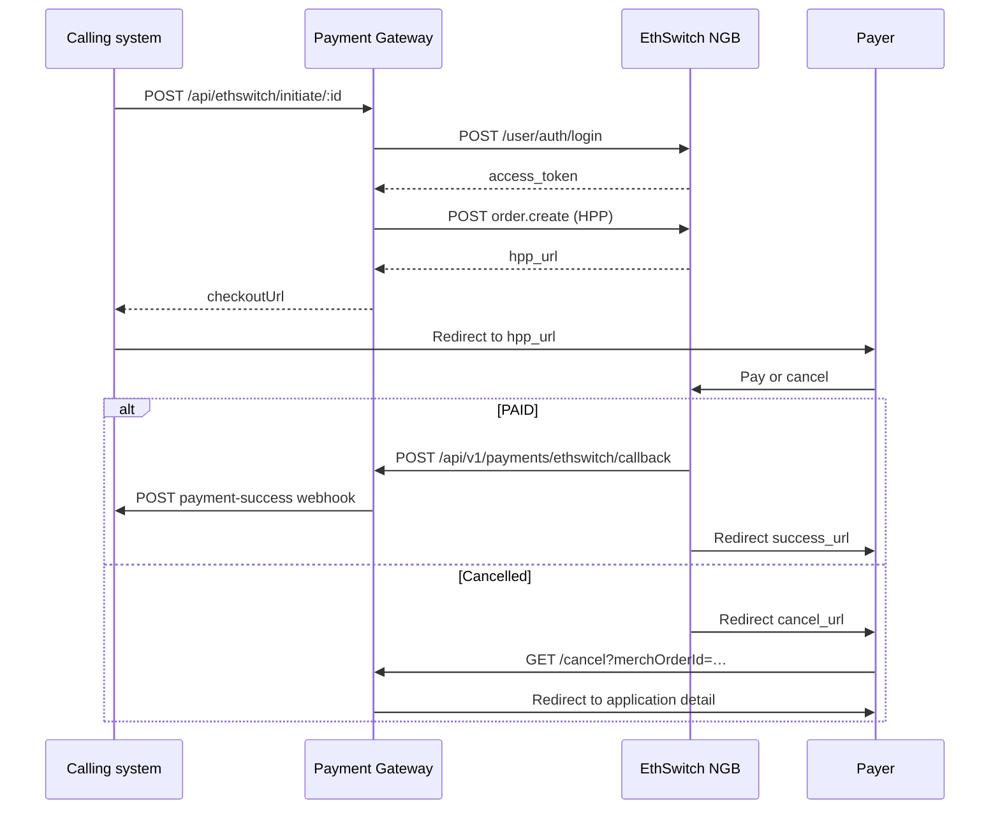

# EthSwitch (NGB) integration

Hosted Payment Page (HPP) integration for **EthSwitch NGB** in the EFDA Payment Gateway microservice.

← Back to [`architecture.md`](architecture.md) · Callback details: [`payments-callback.md`](payments-callback.md)

Official API reference: [NBG API sandbox](https://ethswitch.github.io/ngb-api-sandbox/)

---

## Overview

EthSwitch uses a **redirect-based hosted checkout**:

1. Caller requests initiate → service registers an HPP order with NGB
2. Service returns `checkoutUrl` (`hpp_url`)
3. Payer pays on EthSwitch’s hosted page
4. NGB POSTs completion to our callback URL (`/api/v1/payments/ethswitch/callback`)
5. On `PAID`, we notify the caller via `PAYMENT_SUCCESS_WEBHOOK_URL`

Callback security is configurable: HMAC signature, HTTP Basic Auth, and/or IP allowlist. When none are configured (local dev), trust falls back to matching `merch_order_id` and amount/currency. See [`payments-callback.md`](payments-callback.md) for full details.

---

## HTTP API

| Method | Path | Auth | Description |
|--------|------|------|-------------|
| `POST` | `/api/ethswitch/initiate/:applicationId` | API key (if set) | Start or resume HPP payment |
| `POST` | `/api/v1/payments/ethswitch/callback` | Callback verification | NGB completion webhook |
| `GET` | `/api/ethswitch/cancel` | None | Payer cancel → redirect to SPA |

### Initiate

**Request body** (same as all providers):

```json
{
  "paymentInfoId": 123,
  "amount": 1.00,
  "currency": "ETB"
}
```

**Success response:**

```json
{
  "success": true,
  "message": "Payment initiated successfully.",
  "data": {
    "success": true,
    "checkoutUrl": "https://cbs-uat.ethswitch.et:4443/hpp/…",
    "merchOrderId": "FL12345a1b2c3d4e5f6",
    "transactionId": 1,
    "applicationId": 12345,
    "amount": "1.00",
    "isResume": false
  }
}
```

---

## End-to-end sequence



---

## Gateway protocol

### Authentication

```
POST {ETHSWITCH_BASE_URL}/user/auth/login
Content-Type: application/json

{ "username": "…", "password": "…" }
```

Response:

```json
{ "access_token": "…", "expires_in": 300 }
```

Token is cached in memory at **90% of `expires_in`**. Evicted on HTTP **401** from order calls.

### Register HPP order (`order.create`)

```
POST {ETHSWITCH_BASE_URL}/nbg/api/v1/payment/order/handle?action=order.create
Authorization: Bearer {access_token}
X-Correlation-ID: {uuid}
X-Biller-BIN: {ETHSWITCH_BILLER_BIN}
```

Body (sent as **snake_case**):

```json
{
  "amount": 500,
  "currency": "ETB",
  "merchant_order_number": "FL12345a1b2c3d4e5f6",
  "idempotency_key": "FL12345a1b2c3d4e5f6",
  "description": "Application 12345 Facility License Fee",
  "success_url": "{ETHSWITCH_FRONTEND_BASE_URL}/applications/detail/12345",
  "cancel_url": "{ETHSWITCH_CANCEL_URL}?merchOrderId=…",
  "callback_url": "{ETHSWITCH_NOTIFY_URL}",
  "line_items": [
    {
      "item_name": "Application Fee",
      "quantity": 1,
      "unit_price": 500,
      "total_usage_amount": 500
    }
  ]
}
```

Response fields (gateway uses snake_case; normalized to camelCase in code):

| Gateway field | Stored / returned as |
|---------------|----------------------|
| `hpp_url` | `checkoutUrl` |
| `hpp_token` | `hppToken` on transaction |
| `order_reference` | `orderReference` |
| `expires_at` | `expiresAt` (resume window) |

---

## Service logic

### Initiate (`EthSwitchService.initiatePayment`)

1. Validate `amount > 0`
2. **Resume** — if `PENDING` tx has live `checkout_url` (within `expires_at` or `ETHSWITCH_TIMEOUT_EXPRESS`), return with `isResume: true`
3. **Stale pending** — mark older rows `TIMEOUT`
4. **New order** — `merchOrderId` = `FL{applicationId}{12 random hex chars}`
5. Call `order.create`, persist transaction, create canonical `payment` row, return `checkoutUrl`
6. Log outbound to `ethswitch_api_log`

### Callback (`POST /api/v1/payments/ethswitch/callback`)

Handled by `EthSwitchCallbackService` in the Payments module. Full reference: [`payments-callback.md`](payments-callback.md).

Key payload fields:

| Field | Meaning |
|-------|---------|
| `status` / `current_status` | `PAID` or `FAILED` |
| `data.request_id` | Our `merch_order_id` |
| `transaction_id` | Gateway transaction id |
| `data.bill_info` | Amount/currency integrity check |

Rules:

- Returns HTTP `200` on success and duplicate callbacks; `400` / `401` / `500` on errors
- Idempotent — skip if payment is already in a terminal status (`SUCCESS`, `FAILED`, `CANCELLED`, `EXPIRED`)
- On `PAID` with amount mismatch → mark `FAILED`, do not webhook
- On success → update `payment.payment` + `ethswitch_transaction`, publish `PaymentCompleted` event
- Every request logged to `payment.payment_callback_log` (headers, body, IP, result)

### Cancel (`GET /api/ethswitch/cancel`)

Browser redirect when payer abandons HPP. Marks `PENDING` → `CANCELLED`, then redirects to:

```
{ETHSWITCH_FRONTEND_BASE_URL}/applications/detail/{applicationId}
```

---

## Transaction status lifecycle

Provider table (`ethswitch_transaction`):

```
PENDING ──► SUCCESS    (callback: PAID)
PENDING ──► FAIL       (callback: FAILED, or amount mismatch)
PENDING ──► TIMEOUT    (stale; new initiate creates fresh order)
PENDING ──► CANCELLED  (payer cancel redirect)
```

Canonical `payment.payment` statuses map `FAIL` → `FAILED` and `TIMEOUT` → `EXPIRED`. Terminal states ignore duplicate callbacks.

---

## Data model

Migrations:

- `src/database/001_etswitch.sql` — `ethswitch_transaction`
- `src/database/003_payments.sql` — `payment`, `payment_callback_log`, `ethswitch_api_log`

### `payment.payment` (canonical)

See [`payments-callback.md` § Data model](payments-callback.md#data-model). One row per payment attempt; updated on callback.

### `payment.ethswitch_transaction`

| Column | Purpose |
|--------|---------|
| `payment_info_id` | Caller payment record id |
| `application_id` | For redirects and webhook |
| `merch_order_id` | Unique — idempotency key with NGB |
| `trade_status` | `PENDING`, `SUCCESS`, `FAIL`, `TIMEOUT`, `CANCELLED` |
| `checkout_url` | HPP URL for payer |
| `expires_at` | Gateway-reported link expiry |
| `raw_callback` | Full callback JSON for disputes |

### `payment.ethswitch_api_log`

Audit trail: direction (`INBOUND` / `OUTBOUND`), method, payloads, HTTP status, duration.

### `payment.payment_callback_log`

Per-callback request audit: headers, raw body, source IP, processing result. See [`payments-callback.md`](payments-callback.md).

---

## Source code map

```
src/ethswitch/
  ethswitch.module.ts
  ethswitch.controller.ts
  ethswitch.service.ts
  ethswitch-api.client.ts
  token-cache.service.ts
  dto/ethswitch.dto.ts
  entities/
    ethswitch-transaction.entity.ts
    ethswitch-api-log.entity.ts
  constants/statuses.ts
  utils/normalize-gateway-response.ts   # hpp_url → hppUrl

src/payments/                         # → docs/payments-callback.md
  controllers/ethswitch-callback.controller.ts
  services/ethswitch-callback.service.ts
  verifiers/ethswitch-callback.verifier.ts
  …
```

---

## Configuration

| Variable | Purpose |
|----------|---------|
| `ETHSWITCH_BASE_URL` | Gateway host, e.g. `https://cbs-uat.ethswitch.et:4443` |
| `ETHSWITCH_USERNAME` | Login username |
| `ETHSWITCH_PASSWORD` | Login password |
| `ETHSWITCH_BILLER_BIN` | `X-Biller-BIN` header |
| `ETHSWITCH_CURRENCY` | Default currency (`ETB`) |
| `ETHSWITCH_FRONTEND_BASE_URL` | SPA origin for `success_url` redirect |
| `ETHSWITCH_CANCEL_URL` | Public cancel endpoint on this service |
| `ETHSWITCH_NOTIFY_URL` | Public callback URL — use `/api/v1/payments/ethswitch/callback` |
| `ETHSWITCH_TIMEOUT_EXPRESS` | Pending link window, e.g. `120m` |
| `ETHSWITCH_CALLBACK_SECRET` | HMAC-SHA256 secret for callback signature verification |
| `ETHSWITCH_ALLOWED_IPS` | Comma-separated IPs allowed to POST callbacks |
| `ETHSWITCH_CALLBACK_USERNAME` | HTTP Basic Auth username for callbacks |
| `ETHSWITCH_CALLBACK_PASSWORD` | HTTP Basic Auth password for callbacks |

### Sandbox values ([NBG docs](https://ethswitch.github.io/ngb-api-sandbox/))

| Variable | Example |
|----------|---------|
| `ETHSWITCH_USERNAME` | `admin@eeu.et` |
| `ETHSWITCH_PASSWORD` | `password` |
| `ETHSWITCH_BILLER_BIN` | `NEEUETAA` |

### Local development

- Set `ETHSWITCH_NOTIFY_URL` to the **v1 callback path** on a **public** URL (ngrok) — NGB cannot reach `localhost`
- Example: `https://abc123.ngrok.io/api/v1/payments/ethswitch/callback`
- `ETHSWITCH_CANCEL_URL` can be localhost for browser redirects from your machine
- Callback security env vars are optional in dev; configure at least one in production

---

## Operations & troubleshooting

| Symptom | Likely cause |
|---------|----------------|
| `Payment gateway returned an unexpected response` | Gateway returned `hpp_url` missing — check credentials, BIN, or API path |
| Callback never arrives | `ETHSWITCH_NOTIFY_URL` not publicly reachable |
| Callback returns `401` | HMAC/Basic Auth/IP verification failed — check `ETHSWITCH_CALLBACK_*` env vars |
| Callback returns `400` | Missing `data.request_id` or invalid JSON |
| Initiate works but no webhook | `PAYMENT_SUCCESS_WEBHOOK_URL` unset or caller endpoint down |
| Duplicate payment attempts | Expected — each new initiate after timeout creates new `merch_order_id`; old pending rows are marked `TIMEOUT` |
| `relation "payment.payment" does not exist` | Run `src/database/003_payments.sql` |

Inspect `payment.payment_callback_log` and `payment.ethswitch_api_log` for raw request/response payloads.
