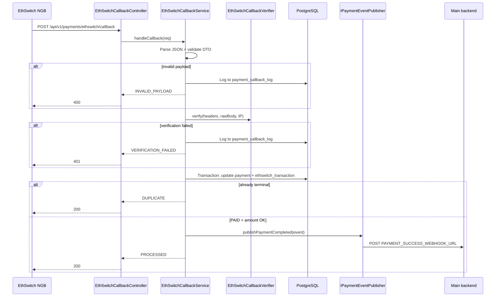

# Payment callbacks

Production callback handling for provider payment notifications in the EFDA Payment Gateway.

← Back to [`architecture.md`](architecture.md)

Provider-specific details:

- [`ethswitch.md` § Callback](ethswitch.md#callback-post-apiv1paymentsethswitchcallback) — EthSwitch NGB
- [`telebirr.md`](telebirr.md) — Telebirr (existing callback; not yet migrated to this module)

---

## Overview

External payment providers (EthSwitch, Telebirr, …) notify this microservice directly when a payer completes or fails a payment. The **Payments module** (`src/payments/`) owns the shared callback infrastructure:

| Concern | Implementation |
|---------|----------------|
| Public HTTP endpoint | Per-provider controller under `api/v1/payments/{provider}/callback` |
| Authentication | Provider-specific verification — **not** JWT or service API key |
| Payload validation | `class-validator` DTOs |
| Audit logging | `payment.payment_callback_log` — timestamp, headers, body, IP, result |
| Idempotency | Skip re-processing when payment is already in a terminal status |
| Persistence | Canonical `payment.payment` row + provider transaction table |
| Success notification | Injectable `IPaymentEventPublisher` (default: HTTP webhook) |

Business logic lives in **services**, not controllers. Controllers only map HTTP status codes.

---

## EthSwitch callback endpoint

| Method | Path | Auth | Description |
|--------|------|------|-------------|
| `POST` | `/api/v1/payments/ethswitch/callback` | Callback verification | EthSwitch NGB completion webhook |

Register **`ETHSWITCH_NOTIFY_URL`** with EthSwitch as the v1 path:

```
https://your-host/api/v1/payments/ethswitch/callback
```

### HTTP responses

| Status | Meaning |
|--------|---------|
| `200` | Callback processed, acknowledged, or duplicate (idempotent) |
| `400` | Invalid JSON or failed `class-validator` checks |
| `401` | Callback verification failed (HMAC, Basic Auth, or IP allowlist) |
| `500` | Unexpected server error |

**Success body:**

```json
{
  "code": "SUCCESS",
  "message": "Payment updated to SUCCESS."
}
```

### Callback payload

Validated by `EthSwitchCallbackDto`:

```json
{
  "status": "PAID",
  "transaction_id": "txn-abc-123",
  "data": {
    "request_id": "FL12345a1b2c3d4e5f6",
    "bill_payment_request_id": "bp-req-001",
    "bill_info": {
      "totalAmount": 500.0,
      "currency": "ETB"
    }
  }
}
```

| Field | Required | Purpose |
|-------|----------|---------|
| `data` | Yes | Wrapper object |
| `data.request_id` | Yes | Our `merch_order_id` / transaction reference |
| `status` / `current_status` | No | `PAID` → `SUCCESS`, `FAILED` → `FAILED` |
| `transaction_id` | No | Provider transaction id |
| `data.bill_info` | No | Amount/currency integrity check on `PAID` |

Non-terminal statuses (e.g. intermediate states) are logged and acknowledged without updating the payment.

---

## Callback verification

Implemented by `EthSwitchCallbackVerifier` (`src/payments/verifiers/ethswitch-callback.verifier.ts`).

All **configured** checks must pass. When no security env vars are set, verification is skipped (local dev only).

| Mechanism | Env vars | Header / source |
|-----------|----------|-----------------|
| IP allowlist | `ETHSWITCH_ALLOWED_IPS` | Client IP (`X-Forwarded-For` aware) |
| HMAC-SHA256 | `ETHSWITCH_CALLBACK_SECRET` | `x-ethswitch-signature`, `x-signature`, or `x-hmac-signature` |
| HTTP Basic Auth | `ETHSWITCH_CALLBACK_USERNAME`, `ETHSWITCH_CALLBACK_PASSWORD` | `Authorization: Basic …` |

**HMAC computation** (for custom integration tests):

```
hex(HMAC-SHA256(ETHSWITCH_CALLBACK_SECRET, raw_request_body))
```

Configure **at least one** mechanism in production.

### Extending verification

Implement `ICallbackVerifier` for new providers:

```typescript
// src/payments/interfaces/callback-verifier.interface.ts
export interface ICallbackVerifier {
  verify(context: CallbackVerificationContext): Promise<boolean>;
}
```

Wire the implementation in `PaymentsModule` with a provider-specific DI token.

---

## Processing flow



### Idempotency

If `payment.payment_status` is already terminal (`SUCCESS`, `FAILED`, `CANCELLED`, `EXPIRED`), the callback is logged as `DUPLICATE` and HTTP `200` is returned without re-processing or re-publishing events.

### Database transaction

Payment and provider transaction updates run inside a single TypeORM transaction. `PaymentCompleted` is published only after a successful `PAID` transition to `SUCCESS`.

---

## Payment statuses

Canonical statuses on `payment.payment`:

| Status | Meaning |
|--------|---------|
| `PENDING` | Checkout initiated, awaiting provider result |
| `SUCCESS` | Payment confirmed |
| `FAILED` | Provider reported failure or amount mismatch |
| `CANCELLED` | Payer cancelled (cancel redirect flow) |
| `EXPIRED` | Checkout window elapsed (`TIMEOUT` on EthSwitch tx) |

EthSwitch provider table (`ethswitch_transaction.trade_status`) uses `FAIL` and `TIMEOUT`; the callback service maps these to `FAILED` and `EXPIRED` on the canonical `payment` row.

---

## Event publishing

On `SUCCESS`, the service emits a `PaymentCompletedEvent`:

```typescript
{
  paymentInfoId: number;
  applicationId: number;
  transactionReference: string;   // merch_order_id
  provider: 'ETHSWITCH';
  providerTransactionId?: string;
  amount: string;
  currency: string;
  paymentMethod: PaymentMethod; // e.g. HPP (EthSwitch hosted payment page)
}
```

**Default publisher:** `HttpPaymentEventPublisher` → `PaymentWebhookService` → `PAYMENT_SUCCESS_WEBHOOK_URL`:

```json
{
  "paymentInfoId": 123,
  "applicationId": 456,
  "merchOrderId": "FL456…",
  "provider": "ETHSWITCH",
  "transId": "txn-abc-123"
}
```

Swap the `PAYMENT_EVENT_PUBLISHER` binding in `PaymentsModule` to publish via RabbitMQ, Kafka, or another transport without changing callback services.

---

## Data model

Migration: `src/database/003_payments.sql`

### `payment.payment`

Provider-agnostic payment record. Created on initiate; updated on callback.

| Column | Purpose |
|--------|---------|
| `transaction_reference` | Merchant order id (unique per provider) |
| `provider_transaction_id` | Gateway-assigned transaction id |
| `amount` / `currency` | Payment amount |
| `payment_status` | `PENDING`, `SUCCESS`, `FAILED`, `CANCELLED`, `EXPIRED` |
| `payment_method` / `provider` | e.g. `ETHSWITCH` |
| `callback_payload` | Full raw callback JSON |
| `callback_received_at` | When the provider notified us |
| `updated_at` | Last modification |

Unique index: `(provider, transaction_reference)`.

### `payment.payment_callback_log`

One row per inbound callback request (including failures).

| Column | Purpose |
|--------|---------|
| `provider` | e.g. `ETHSWITCH` |
| `correlation_id` | Request tracing id |
| `transaction_reference` | Parsed merch order id, if available |
| `request_headers` | JSON-serialized headers |
| `request_body` | Raw body |
| `source_ip` | Client IP |
| `processing_result` | `PROCESSED`, `DUPLICATE`, `INVALID_PAYLOAD`, `VERIFICATION_FAILED`, `INTERNAL_ERROR` |
| `processing_error` | Error detail when applicable |
| `duration_ms` | Processing time |
| `received_at` | Timestamp |

Provider-specific tables (`ethswitch_transaction`, `telebirr_transaction`) are still updated for backward compatibility and provider-specific fields.

---

## Source code map

```
src/payments/
  payments.module.ts
  controllers/
    ethswitch-callback.controller.ts
  services/
    ethswitch-callback.service.ts
    payment-callback-log.service.ts
  verifiers/
    ethswitch-callback.verifier.ts
  publishers/
    http-payment-event.publisher.ts
  dto/
    ethswitch-callback.dto.ts
    callback-response.dto.ts
  entities/
    payment.entity.ts
    payment-callback-log.entity.ts
  interfaces/
    callback-verifier.interface.ts
    payment-event-publisher.interface.ts
    callback-handle-result.interface.ts
  constants/
    payment-status.enum.ts
    payment-provider.enum.ts
    injection-tokens.ts
```

Tests:

| File | Type |
|------|------|
| `src/payments/verifiers/ethswitch-callback.verifier.spec.ts` | Unit |
| `src/payments/services/ethswitch-callback.service.spec.ts` | Unit |
| `test/ethswitch-callback.e2e-spec.ts` | Integration (requires PostgreSQL) |

---

## Configuration

| Variable | Purpose |
|----------|---------|
| `ETHSWITCH_NOTIFY_URL` | Callback URL registered with NGB — use the v1 path |
| `ETHSWITCH_CALLBACK_SECRET` | HMAC-SHA256 secret for signature verification |
| `ETHSWITCH_ALLOWED_IPS` | Comma-separated allowed source IPs |
| `ETHSWITCH_CALLBACK_USERNAME` | Basic Auth username for callbacks |
| `ETHSWITCH_CALLBACK_PASSWORD` | Basic Auth password for callbacks |
| `PAYMENT_SUCCESS_WEBHOOK_URL` | Main backend webhook on `PaymentCompleted` |

See [`.env.example`](../.env.example) for the full template.

---

## Adding a new provider callback

1. Add `{Provider}CallbackDto` with `class-validator` decorators
2. Implement `{Provider}CallbackVerifier` implementing `ICallbackVerifier`
3. Add `{Provider}CallbackService` with provider-specific status mapping
4. Add `{Provider}CallbackController` at `POST /api/v1/payments/{provider}/callback`
5. Register providers in `PaymentsModule`
6. Add migration if new columns are needed on `payment.payment`
7. Document in `docs/{provider}.md`

Telebirr callbacks currently remain on `POST /api/telebirr/callback` and can be migrated to this pattern later.

---

## Operations & troubleshooting

| Symptom | Likely cause |
|---------|----------------|
| `401` from callback | HMAC/Basic Auth/IP mismatch — check env vars and `payment_callback_log` |
| `400` from callback | Missing `data.request_id` or malformed JSON |
| Callback `200` but no status change | Non-terminal `status` or unknown `request_id` — check log `processing_error` |
| Duplicate webhook delivery | Expected — idempotency prevents re-processing; first `SUCCESS` already published |
| `payment` table missing | Run `src/database/003_payments.sql` |

Inspect `payment.payment_callback_log` for full request/response audit trail.
